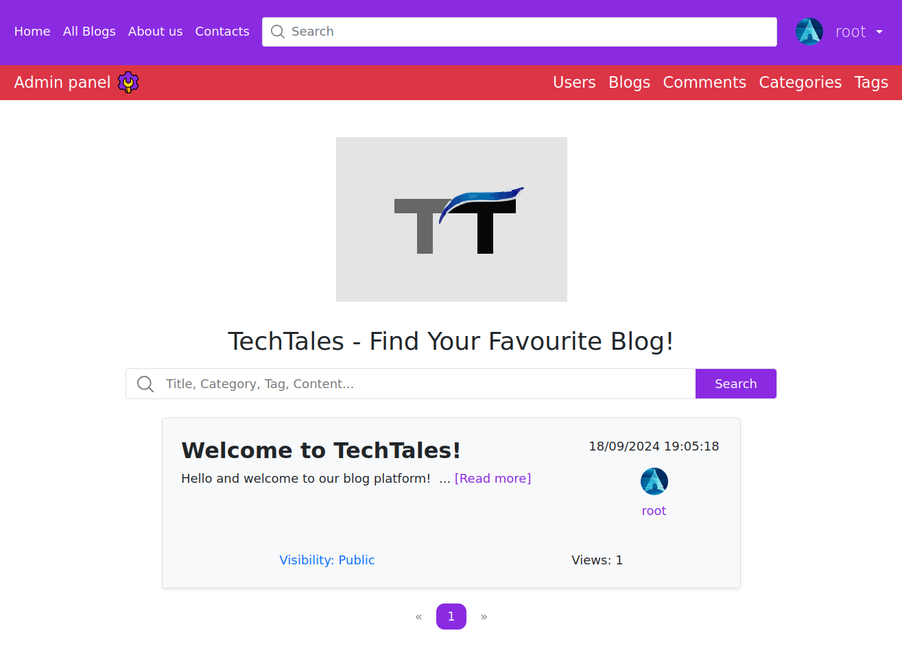
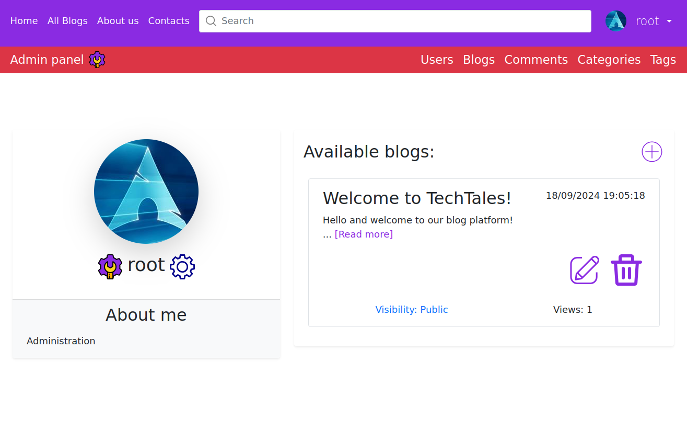
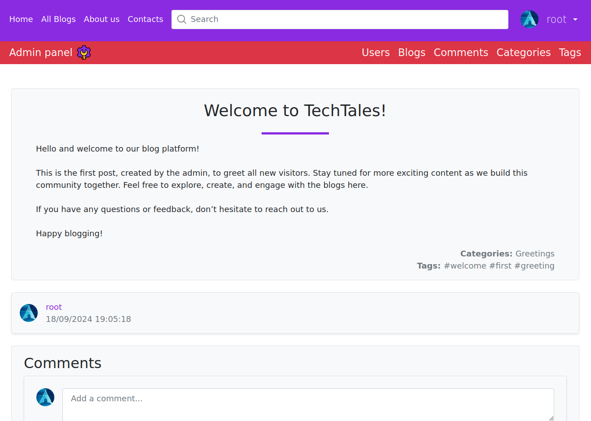
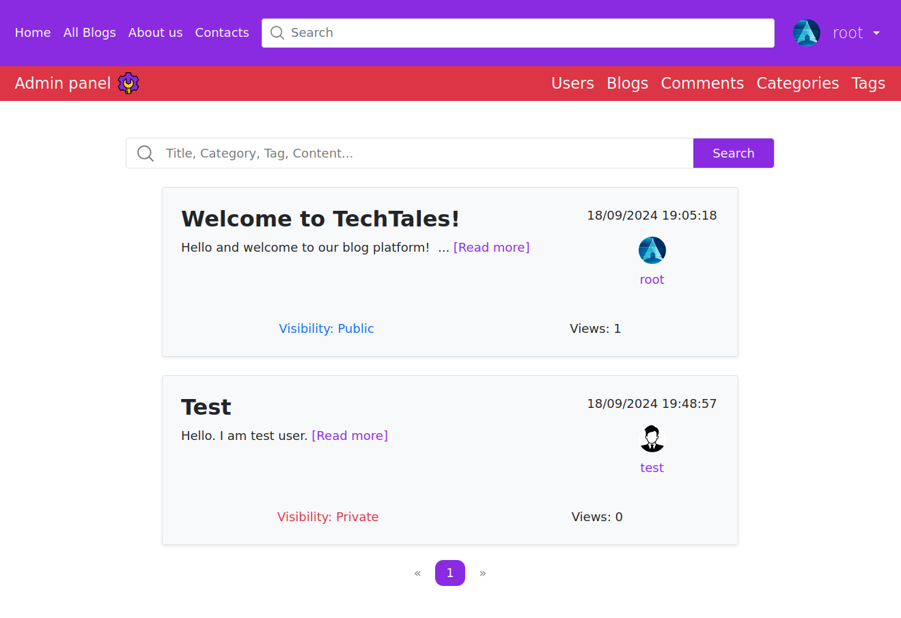
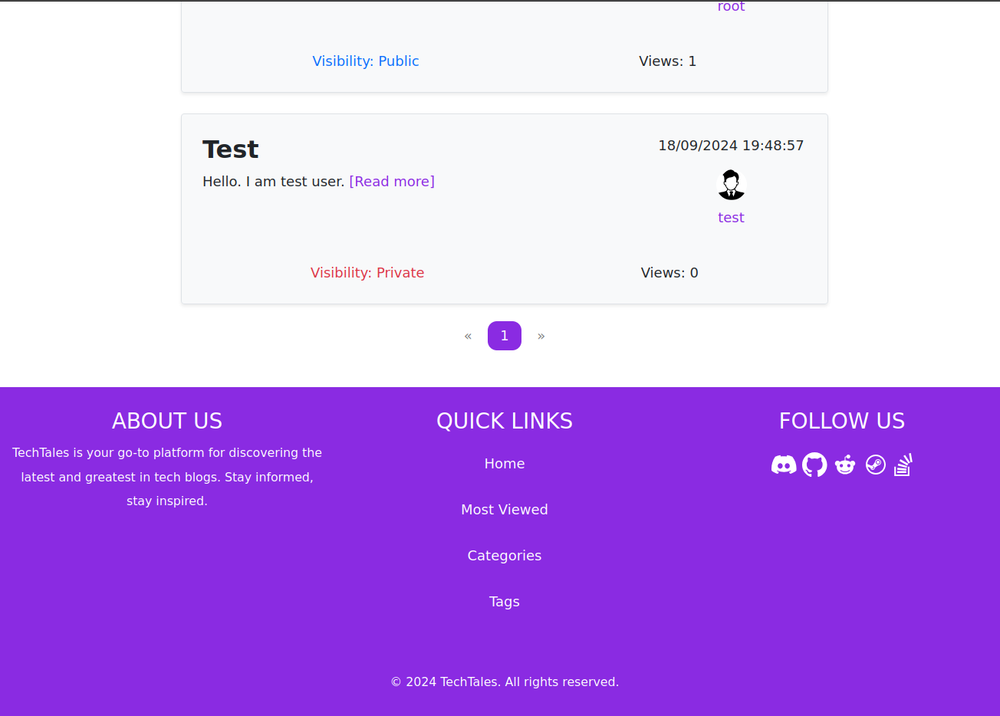
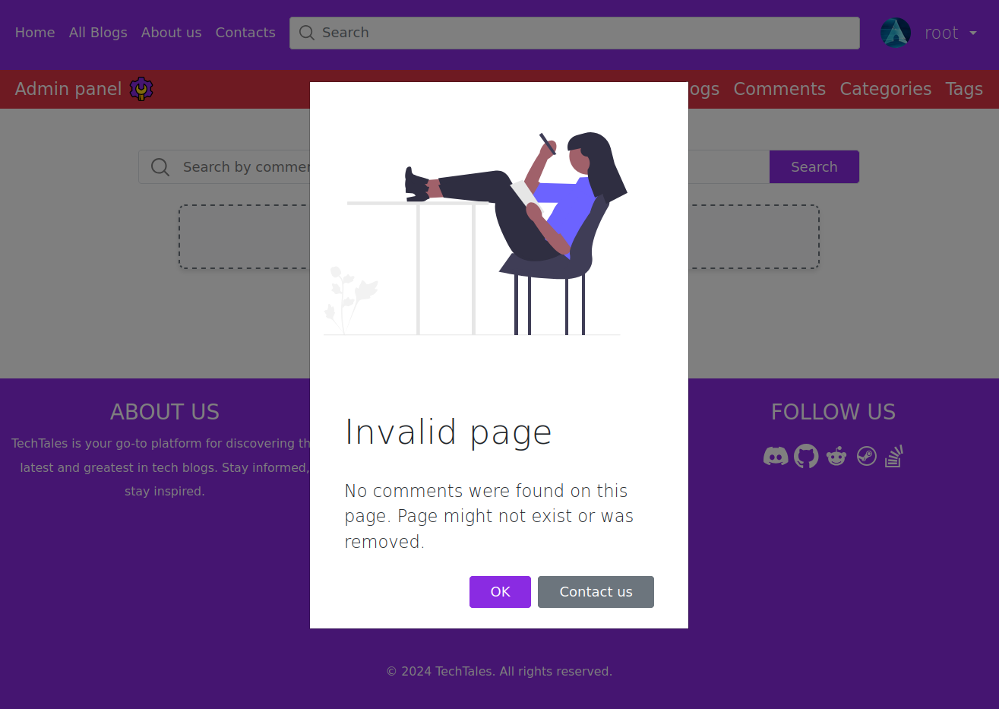

# TechTales

**TechTales** is a simple website developed using C# and ASP.NET Core MVC that allows users to create and manage their own blogs.

## Features

- **Create and manage blogs**: Users can create, edit, and delete their own blogs.
- **Blog interactions**: Read other users' blogs, and leave comments to engage with the content.
- **User profiles**: Customize your profile with personalized information.
- **Public/Private visibility**: Blogs can be set to public or private visibility.
- **Tags and categories**: Blogs can be organized using tags and categories for better searchability.
- **Search functionality**: Search blogs, tags, and categories efficiently.
- **View count**: Blogs display the number of views they have accumulated.

## Hidden features

**Administration:**
- Can ban or delete users.
- View and manage all users, categories, comments, blogs, and tags, including private blogs and categories.
- Edit or delete any user's comments or blogs.
- Read private blogs.

**Moderation:**
- Can ban users.
- View all users, categories, comments, blogs, tags, and categories, including private ones.

## Screenshots

### Home page



### Profile page



### Blog page



### Blog list



### Footer



### Modal window



**Note**: There are more pages, but these are the main ones.

## Getting Started
### Prerequisites

To get started, ensure you have the following installed:

- .NET Core Runtime
- ASP.NET Core Runtime
- MySQL Server (or MariaDB)
- Git

## Clone the repository:

```
git clone https://github.com/Quikler/TechTales.git
```

## Setup Instructions

### 1. Navigate to the project directory:
```
cd TechTales
```

### 2. Install dependencies:
Restore the necessary packages by running:
```
dotnet restore
```

### 3. Configure the database:
Update the ```appsettings.json``` file with your MySQL connection string.

### 4. Create the database:
In MySQL, run the following command to create the database:
```
CREATE DATABASE techtales;
```

### 5. Run the migrations:
```
dotnet ef database update
```

### 6. Run the application:
Start the app with:
```
dotnet run
```

## Support

If you have any questions or encounter any issues, feel free to <a href="https://github.com/Quikler/TechTales/issues">open an issue</a> or contact me directly.

## Libraries and Frameworks

### Backend:
- ASP.NET Core Identity
- Entity Framework Core
- MySQL (or MariaDB)
- SignalR

### Frontend:
- ASP.NET Core MVC
- Bootstrap

## License

This project is licensed under the MIT License. See the [LICENSE](https://github.com/Quikler/TechTales/blob/master/LICENSE) file for more details.

### Developed with ❤️ by Quikler